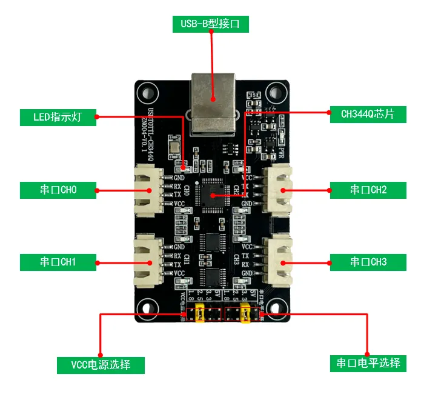
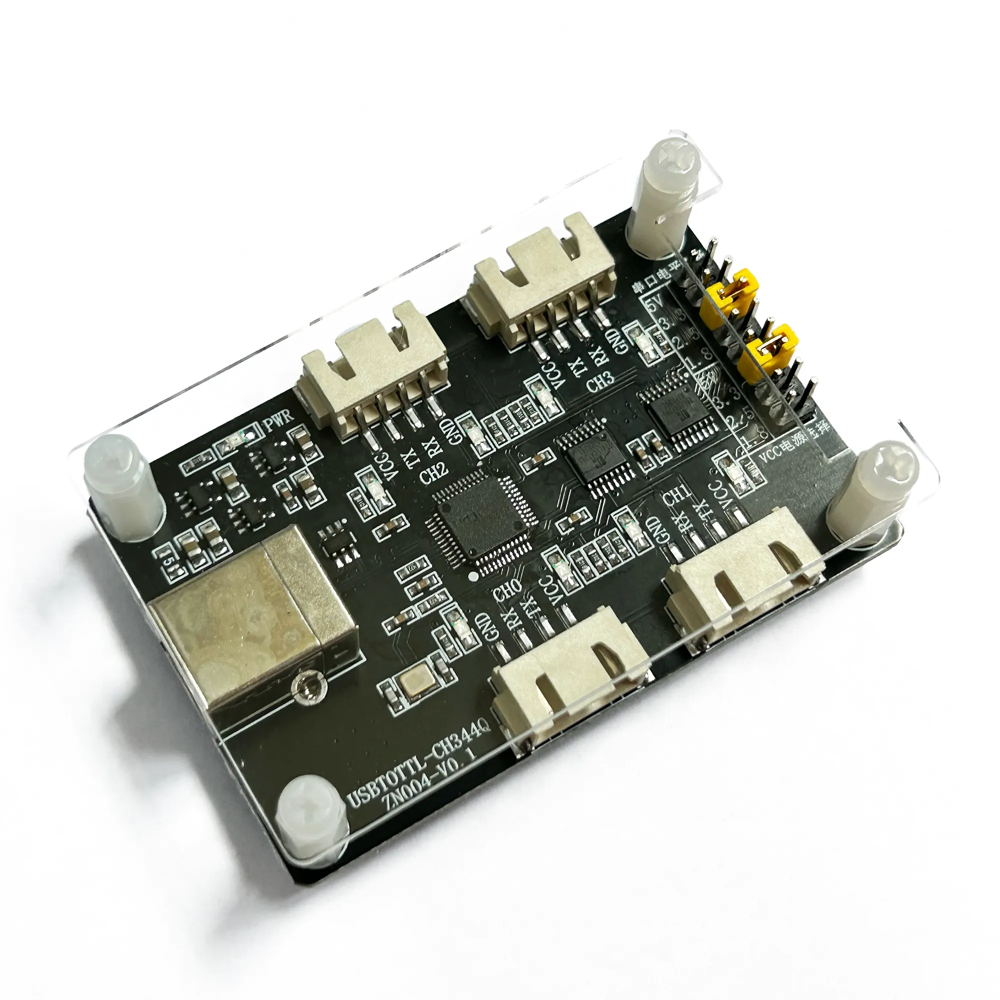
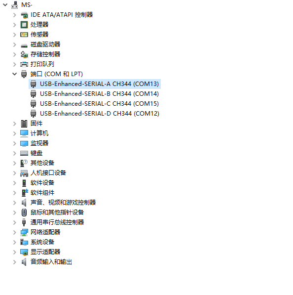

ZN004-CH344Q-四电压
===================

产品介绍

ZN004-CH344Q为一款四路USB转TTL工具板，串口电压以及输出电压支持四电压，即1.8V、2.5V、3.3V、5V。通过USB方口与PC端进行连接，默认配套上盖亚克力，对外接口为XH2.54-4P端子

因对外端子接口不是每个客户需要的，默认不赠送XH2.54-4P的线材，需客户根据自身需求，进行选购！

|image1|

|image2|

驱动程序(Windows)
=================

如果插入Windows电脑后，不安装驱动，使用系统自带的驱动，可能会出问题，例如\ **长数据丢包**\ 等问题。\ **因此不建议使用系统自带的驱动，建议安装如下驱动：**

直接下载：:download:`CH344Q驱动 <./CH344Q驱动.zip>`

**Q&A**
=======

Q：USB插入电脑后，window电脑无法正常识别

A：请检查是否安装USB驱动程序，可以在PC端的设备管理器中查看，正常情况如下

|image3|

